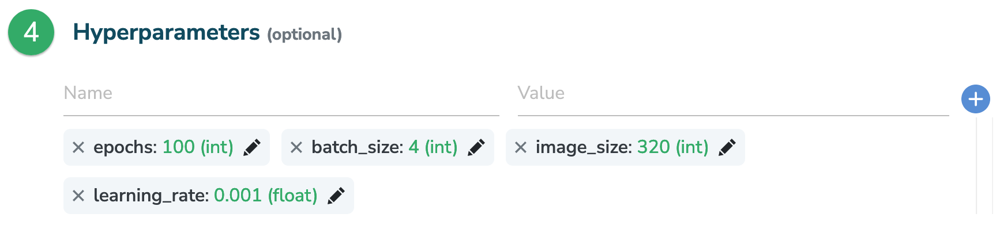
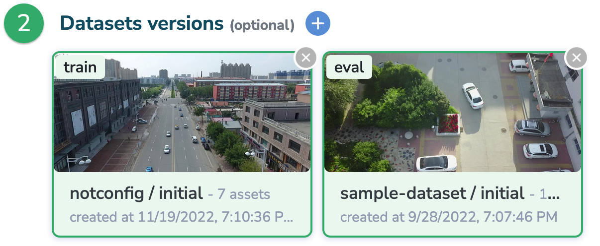
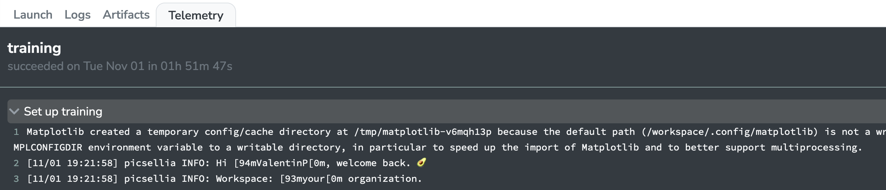
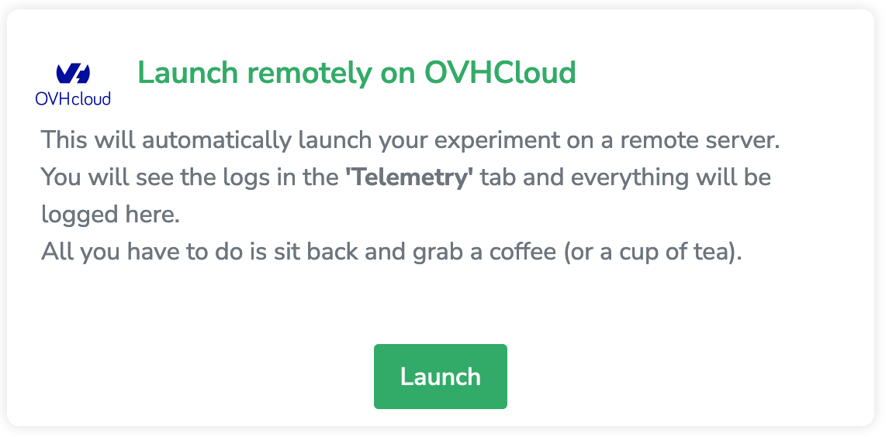

# Build and register your custom training Docker image

This is a guide on how to package your code so it can run on our infrastructure

## Table of contents

- [Introduction and tutorial context](#introduction-and-tutorial-context)
- [Create a model in your Picsellia model registry](#create-a-model-in-your-picsellia-model-registry)
- [Prepare your script](#prepare-your-script)
- [Build the Docker image](#build-the-docker-image)
- [Push your Docker image](#push-your-docker-image)
- [Conclusion](#conclusion)
  

### Introduction and tutorial context

For the sake of this tutorial, let's say that you managed to train a classification model and integrate our Picsellia SDK in your code so you can:

- Retrieve your images from the platform
- Log your metrics (loss, accuracy, confusion matrix...) in an experiment dashboard on the platform
- Store your model's artifacts after training (checkpoints, weights, config..)

That's a great starting point if you want to track your experiments using our platform, but do you know that you can go **_further_**?

Indeed you can now package your training script and the base model so it can be used by other people in your organization to create new experiments easily and also **run them on our infrastructure**

### Create a model in your Picsellia model registry

> 📝  **Note:** If you already have a model in your registry with labels, weights and parameters, you just have to fetch it and run the last `update(docker_image_name, docker_flags)` line of the script and skip to [the next step](#prepare-your-script).

In the `create_model.ipynb` file, fill empty strings with your API token (you can find it in your Picsellia profile settings page), the name of the organization you want to register this model in and finally the desired model's name.

As previously stated, we want to create a **classification model** and in our case, the framework used to train it is **_Keras_**.
This is why you can see that we set the **type** to `InferenceType.CLASSIFICATION` and the **framework** to `Framework.Tensorflow` (as **Keras** is now part of **Tensorflow**). 

> 💡 **Tip:** If you wanted to repeat this procedure for another type of model or framework, feel free to change those arguments to `InferenceType.OBJECT_DETECTION` and `Framework.PYTORCH` for example.

Then we defined a set of parameters that are actually used by our script during training:

```python
base_parameters = {
  "image_size": 320,
  "batch_size": 4,
  "epochs": 100,
  "learning_rate": 0.001
}
```

Remember when you are creating an experiment and choose a **base model** from your registry or the model Hub ? And then you see that the Hyperparameters section is already filled with these 👇 ?
<!--  -->

</img>

This is because when creating the model and adding to the registry (just like you're doing now) we've specified those base_parameters!

And after that you can access those parameters using the logs of your experiment by doing:

```python
parameters = experiment.get_log("parameters")
batch_size = parameters["batch_size"]
```

> You've now learned one of the dark arcanes of Picsellia 🧙

You can update those `base_parameters` based on your needs, for example if your script needs a variable called `random_seed`, you can add something like `random_seed: 42` to the dictionnary.

### Prepare your script

A quick reminder of the most important steps before you can say you integrated our SDK in your scripts:

- You get credentials and Ids used to fetch your experiment from environment variables, which means they are not hardcoded anymore: {#environment-variables}
  
  ```python
    import os 
    from picsellia import Client

    api_token = os.environ("api_token")
    organization_name = os.environ("organization_name")
    client = Client(api_token=api_token, organization_name=organization_name)

    project_name = os.environ("project_name")
    project = client.get_project(name=project_name)

    experiment_name = os.environ("experiment_name")
    experiment = project.get_experiment(name=experiment_name)
  ```

  > Once you've done this, your scripts will be dynamically reusable by just changing the environment variables given to the script.
- You retrieve your dataset from your experiments because you attach them when you create it:
  
   </img>

    and they can then be fetched this way for example: 

    ```python
    train_data: DatasetVersion = experiment.get_dataset("train")
    train_data.download("data/train")
    ```

- You update the labelmap with the labels coming from your **datasets** (as they can be different from the labelmap of the **base model**):
  
   ```python
   labels = dataset.list_labels()
   
   labelmap = {str(i+1): labels[i].name for i in range(len(labels))}
   print(labelmap)

   >>> {'1': 'label1', '2': 'label2', '3': 'label3'}
   ```

- You log everything that needs to be tracked to your experiment:
  
   ```python
   history = model.fit(...)
   accuracy: list = history["accuracy"]
   experiment.log(name="accuracy", accuracy, type="line")
   ```

- And finally you store all the files you need to reuse this model later, for training or inference:
  
  ```python
  experiment.store(name="keras", path="model.h5")
  ```

> ⚠️ **Warning:** Those are examples, please change them according to your needs and make sure that your script actually run completely after integration

After making sure that your script is well integrated with picsellia and it get all the information needed to [retrieve the right experiment from environments variables](#prepare-your-script), just follow the steps below:

1. Copy your script in the script.py file (⚠️ Do not change this file name or your code won't be launched.)
2. If you need some other packages than picsellia, you can add them to the requirements.txt file so they will be added during the build (don't forget to fix versions of the packages to avoid surprises with updates) for example:

    ```txt
    Tensorflow==2.11.0
    ```

    > ⚠️ **Warning:** No packages are pre-installed appart from the `picsellia` package so make sure that you add everything you need to the `requirement.txt` file or your script will probably not run..
3. If you need some other dependencies, for example if you have some utilities that you store next to your script this way:

    +-- script.py \
    +-- utils \
    | &nbsp; +-- utils.py

    Make sure to copy/paste them in the `training-folder` so your script is able to access them.

>💡  **Info:** Do not worry about the `launch_subprocess.py` we will explain in the next section what it is used for but you don't have to change it.
### Build the Docker image

As we want to build a Docker image with our script and dependencies, we can find a **Dockerfile** in the `training-package` folder.

This Dockerfile has been written entirely so you don't have to change anything, indeed it's based on an **Nvidia/CUDA** base image so GPU acceleration is enabled by default, and it will install everything from the `requirements.txt` file and build all the folders and scripts that are inside. `training-folder`.

You can also notice that the last command doest not run your script but the `launch_subprocess.py` file that we talked right before.
This script is there to launch your own script as a *subprocess* that will allow us to capture the output of your code and send it to the platform so you can follow the training live in the `Telemetry` tab of your experiment:

</img>

More info about how to custom the output and the section of this tab in another tutorial.


Now on to the build!

If you want to upload your image to the public **Docker Hub**, your can simply use this command:

```bash
docker build training-package/. -t <:docker_username>/<:image_name>:capture

```

where:

- <:docker_username> is your username on the **Docker Hub**
- <:image_name> is the desired image name, make sure that it is unique among your Docker registry
- capture is the tag used to run your image on Picsellia, **please do not change it**!

And now the most import part of this tutorial, you have to update your picsellia model like this:

```python
model: Model = client.get_model("my-awesome-model")
version: ModelVersion = model.get_version(0) # Please adapt for another version

docker_image_name = "<:docker_username>/<:image_name>"
version.update(docker_image_name=docker_image_name)
```

> ⚠️ **Warning:** The important fact to notice here is that the docker_image_name variable that you update in your model is composed of the username AND the image name, which gives us the complete path to your image


If we gave you access to your **private Docker Registry** on Picsellia, the steps are slightly different.

Ask us for your `DOCKER_URL` which is the adress of your private registry. We will also give you a `DOCKER_LOGIN` and a `DOCKER_PASSWORD`.

Now, launch the build command:

```bash
docker build training-package/. -t <:DOCKER_URL>/picsellia/<:image_name>:capture
```

where:

- picsellia is the user we create for you in our private registry, **please do not change it**
> Once again, make sure that the chosen `image_name` is unique amongst all the images you want to push to our registry.

> ⚠️ **Warning:** The important fact to notice here is that the docker_image_name variable that you update in your model is composed of the DOCKER_URL AND the username AND the image name, which gives us the complete path to your image
### Push your Docker image

For **Docker Hub** users, just login with your traditional credentials and then:

```bash
docker push <:docker_username>/<:image_name>:capture
```

For **private registry** users, login with the `DOCKER_LOGIN` and `DOCKER_PASSWORD` when you launch this command:

```bash
docker login
```

Once successfully authenticated, run the **push** command:

```bash
docker push <:DOCKER_URL>/<:docker_username>/<:image_name>:capture
```

Aaaand Tadaa! You model is now pushed in a Container registry and accessible from Picsellia 🎉 

### Conclusion

You can now create new experiments on Picsellia using your packaged model as a base model. As your model is attached to a docker image somewhere, we can now run experiments remotely by only clicking the `Launch` button in the `Launch` tab of our experiment, and follow the machine output live in the `Telemetry tab`

</img>